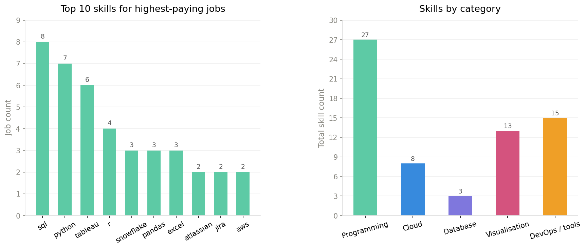
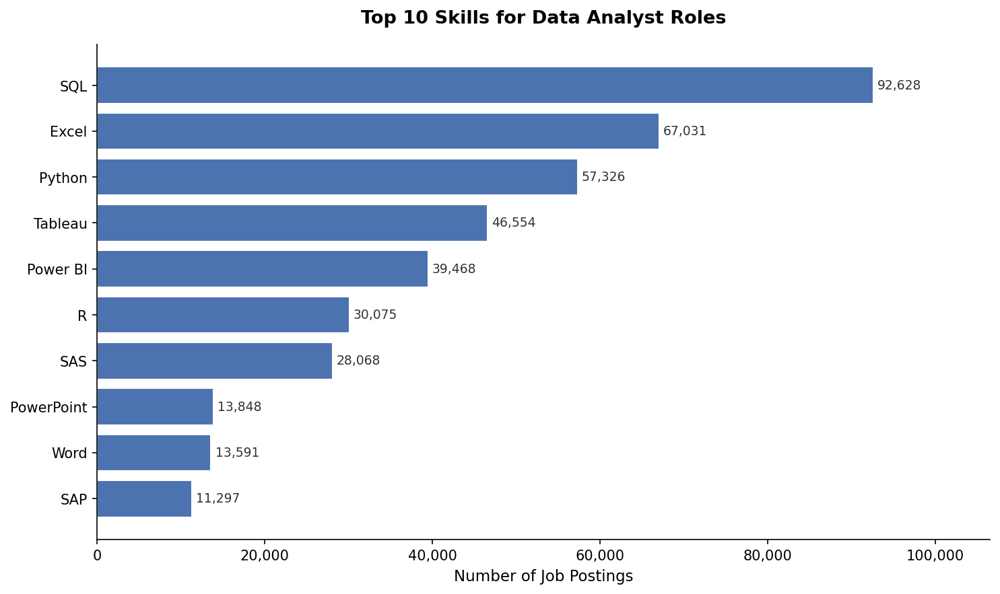

# Introduction
Dive into the data job market! <br> 
This project explores **top-paying** jobs and associated skills, **in-demand** skills and skills which are **both** in high-demand and high salary in data analytics 

SQL queries? Check them out here: [project_sql_folder](/project_sql/)

# Background
Driven by my passion for data and a desire to understand the job market, I embarked on this project to analyse the landscape of data analyst roles, specifically focusing on the skills which are in high demand and good pay for Junior data analysts as well as the skills which are crucial for career progression. <br>

The data for this project is sourced from Luke Barousse's [SQL Course](https://lukebarousse.com/sql). It contains insights into job titles, salaries, locations, and essential skills for various Data roles. <br>

The Questions I will be delving into include: <br>
1. What are the top-paying jobs in the data analytics field?
2. What are the skills required for those top-paying jobs?
3. What are the skills in demand across all data analyst roles?
4. Which skills are associated with higher salaries?
5. What is the optimal skill to learn based on demand and salary?

# Tools I used
For this project, I utlised a variety of tools:

- **SQL** was the backbone of my analysis, allowing me to query the database and unearth insights
- **PostgreSQL** was my chosen database management system.
- **VsCode** My go to for interacting with the database and writing SQL queries.
- **Git and Github** was essential for version control and sharing my SQL scripts and findings.

# The Analysis
Each query for this project aimed at investigating a key ascpect of the 2023 data analyst job market. Here's how approach each question:

### 1. Top paying Data Analyst Jobs in Australia
I queried the database to identify the highest-paying roles by filtering for data analyst positions in Australia with salaries information and then ordered them by salary to find the high-paying oppurtunities in the field.

```sql
SELECT
    job_postings_fact.job_id,
    job_postings_fact.job_title,
    job_postings_fact.job_location,
    job_postings_fact.job_schedule_type,
    job_postings_fact.salary_year_avg AS average_yearly_salary,
    job_postings_fact.job_posted_date::DATE AS posted_date,
    company_dim.name AS company_name
FROM 
    job_postings_fact
LEFT JOIN 
    company_dim ON job_postings_fact.company_id = company_dim.company_id
WHERE 
   job_title_short = 'Data Analyst' AND
   job_location LIKE '%Australia%' AND
   salary_year_avg IS NOT NULL
ORDER BY 
    salary_year_avg DESC
LIMIT 10;
```
### Results
Here is the breakdown for highest paying Data Analyst jobs in Australia from 2023: <br>
**Limited data analyst roles:** Only 4 recorded Data Analyst roles in Australia with annual salalary details. <br>
**Wide Salary Range** Data Analyst roles in Australia ranges between $135,0000 - $57,500. <br>
**Lack of Aussie employers** The Data Analyst roles present in dataset are offered by a variety of four companies:Doordash, Enatin and Sodexo. Half of which are not Australian businesses. The dataset is clearly missing Australian business like Commonwealth Bank and clearly not representative (Don't stress Australian data nerds) <br>

### 2. Skills required for top-paying Data Analyst jobs 
I identified the top-paying skills associated with the top ten highest paying-data analyst jobs by sub-querying the top-paying jobs from Question 1 and then joining with the skills table to find the relevant skills for those roles.

```sql  
SELECT 
    top_paying_jobs.*,
    skills_dim.skills
FROM
    top_paying_jobs
INNER JOIN
    skills_job_dim ON top_paying_jobs.job_id = skills_job_dim.job_id
LEFT JOIN
    skills_dim ON skills_job_dim.skill_id = skills_dim.skill_id
ORDER BY
    top_paying_jobs.average_yearly_salary DESC;
```
``` sql
SELECT
    skills_dim.skills,
    COUNT(*) AS skill_count
FROM 
    skills_job_dim
INNER JOIN
    top_paying_jobs ON skills_job_dim.job_id = top_paying_jobs.job_id
LEFT JOIN
    skills_dim ON skills_job_dim.skill_id = skills_dim.skill_id
GROUP BY
    skills_dim.skills
ORDER BY
    skill_count DESC;
```
### Results


Here is a breakdown of most prominent skills in demand for top-paying data analyst jobs: <br>
**SQL** is the most in-demand skill for top-paying data analyst jobs, appearing in 80% of the top-paying roles. <br>
**Programming Languages** is very popular, with **Python** being the second most in-demand skill, appearing in 60% of the top-paying roles and **R** appearing in 40% of the top-paying roles. <br>
**Data Visualization** skills are also highly valued, with Tableau appearing in 60% of the top-paying roles and being the third most popular skill category. <br>
**Niche skills** are likely associated with higher salaries, with DevOps Tools like like atlassian, jira, etc, cloud computing skills like AWS or Azure and Database management software like Oracle appearing prominently in top-paying roles. <br>

## 3. What are the skills in demand across all data analyst roles?
I identified the top ten most in-demand data analyst skills across all data analyst job postings by filtering for Data Analyst roles, joining with skills tables and counting the occurences of each skill. 

```sql
SELECT 
    skills_dim.skills AS skill,
    COUNT(*) AS skill_count
FROM
    skills_job_dim
LEFT JOIN skills_dim ON skills_job_dim.skill_id = skills_dim.skill_id
WHERE
    job_id IN
    (SELECT 
        job_id
     FROM
        job_postings_fact
     WHERE
        job_title_short = 'Data Analyst')
GROUP BY
    skill
ORDER BY
    skill_count DESC
LIMIT 10;
```
### Results


Here is a breakdown of the most in-demand skills across all data analyst roles: <br>
- **SQL** leads by a wide margin (92,628 postings — 25,000+ ahead of second place)
- **Excel** remains dominant at 67,031, but **Python** (57,326) and **R** (30,075) are closing the gap, suggesting a gradual shift toward programmatic analysis
- **Visualisation tools** are highly sought after — **Tableau** (46,554) and **Power BI** (39,468)
- **Business tools** like **SAS** (28,068) and **SAP** (11,297) round out the top 10, alongside **PowerPoint** and **Word** for reporting and presentation

# What I Learned

# Conclusions
